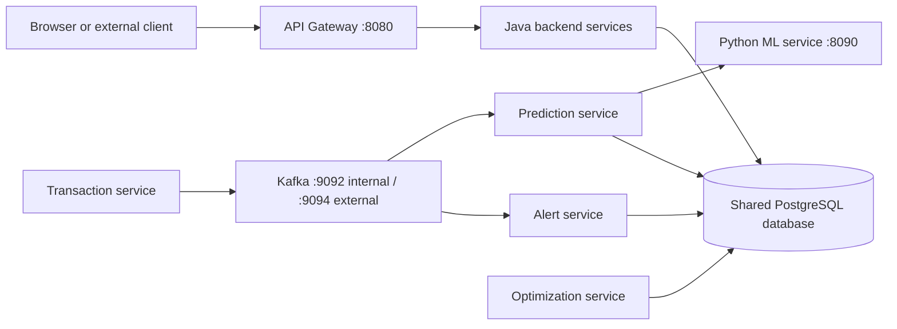

# Verified Architecture Report

**Project:** ATM Cash Flow Optimization Platform  
**Evidence:** Checked-in Java, Python, YAML, Docker Compose, migration, test, and documentation files inspected during the architecture audit.  
**Scope:** This document records the current repository state. It is not a target-state redesign.

## 1. System Overview

The repository contains a Java 17/Spring Boot multi-module backend, a Python FastAPI forecasting service, PostgreSQL, Kafka, a Spring Cloud Gateway, and Docker Compose deployment configuration. No frontend application is present in the repository root; the documented browser client is therefore an external or not-yet-checked-in client.

The current operational path is:



The Gateway is the intended browser entry point. Docker Compose also publishes individual Java service ports, so direct service access remains possible.

## 2. Current Services

The following status values reflect the Docker health check observed during the audit, not a permanent availability guarantee.

| Service | Technology | Port | Current responsibility | Audit status |
| --- | --- | ---: | --- | --- |
| `api-gateway` | Spring Cloud Gateway | 8080 | Browser-facing routing, JWT signature validation, CORS, correlation IDs, logging, rate limiting, upstream error handling | Healthy during audit |
| `auth-service` | Spring Boot, Spring Security, JPA | 8081 | Registration, login, logout, access JWTs, refresh-token rotation, authentication audit records | Healthy during audit |
| `user-service` | Spring Boot, JPA foundation | 8082 | User-service module and health endpoint; no business REST controller was found in the audit inventory | Healthy during audit |
| `bank-service` | Spring Boot, JPA foundation | 8083 | Bank-service module and health endpoint; no business REST controller was found in the audit inventory | Healthy during audit |
| `atm-service` | Spring Boot, JPA, Flyway, JWT | 8084 | Authenticated ATM CRUD, filtering, pagination, status calculation, soft deactivation, audit logging | Healthy during audit |
| `transaction-service` | Spring Boot, JPA, Kafka, JWT | 8085 | Idempotent ATM transactions, atomic cash mutation, summaries, transaction events | Healthy during audit |
| `cash-inventory-service` | Spring Boot, JPA, Flyway, JWT | 8086 | Denomination inventory and refill workflow | Healthy during audit |
| `prediction-service` | Spring Boot, JPA, Kafka, REST client | 8087 | Prediction persistence, ML calls, prediction events, prediction consumers | Healthy during audit |
| `alert-service` | Spring Boot, JPA, Kafka | 8088 | Risk evaluation, alert persistence, acknowledgement and resolution, prediction-event consumer | Healthy during audit |
| `optimization-service` | Spring Boot, JPA | 8089 | Refill recommendation calculation and approval/rejection workflow | Healthy during audit |
| `ml-service` | Python FastAPI, scikit-learn | 8090 | Loads the persisted seven-day forecasting artifact and serves forecast APIs | Healthy during audit |
| `notification-service` | Spring Boot foundation | 8091 | Notification-service module and health endpoint; delivery implementation was not confirmed in the audit inventory | Healthy during audit |
| `analytics-service` | Spring Boot, JPA | 8092 | Dashboard aggregate and paged analytics APIs over the shared schema | Healthy during audit |
| `config-server` | Spring Boot | 8888 | Config-server module and health endpoint | Healthy during audit |
| `service-registry` | Spring Boot | 8761 | Service-registry module and health endpoint | Healthy during audit |

`java-runtime` is a Docker build helper that runs `true` and exits. It is not an application service.

## 3. Service Registry

**Present:** The `service-registry` module, Dockerfile, Compose service, application class, and port `8761` exist.

**Configured:** The service is configured to start as a Spring Boot application and has a health check.

**Actively used:** No Eureka server dependency, Eureka client dependency, discovery annotation, or service discovery configuration was confirmed in the inspected POMs and resources. Service URLs are configured explicitly through environment variables. Eureka/Service Registry is therefore **present but not actively integrated** with the other services based on repository evidence.

## 4. Config Server

**Present:** The `config-server` module, Dockerfile, Compose service, application class, and port `8888` exist.

**Configured:** The service starts as a Spring Boot application and has a health check.

**Actively used:** No Spring Cloud Config Server dependency or client-side `spring.config.import` integration was confirmed in the inspected POMs and resources. Services contain local `application.yml` and profile files and receive deployment values through environment variables. Config Server is therefore **present but not actively integrated** based on repository evidence.

## 5. Database Architecture

PostgreSQL is deployed as one Compose database named `postgres`, published on host port `5433` and listening on container port `5432`. The domain module contains the shared Flyway migrations, including the core schema and `processed_events`.

The following services access PostgreSQL in their checked-in configuration:

- `auth-service`
- `user-service`
- `bank-service`
- `atm-service`
- `transaction-service`
- `cash-inventory-service`
- `prediction-service`
- `alert-service`
- `optimization-service`
- `analytics-service`

The current design is a **shared database/schema**, not separately owned databases per microservice. The common `domain` module supplies entities and repositories used by multiple services. `analytics-service` explicitly reads the shared schema with Hibernate validation and Flyway disabled.

### Shared-schema risks

- Services are coupled to common tables, entity mappings, and migration history.
- A schema change can affect multiple deployable services.
- Database permissions cannot enforce strong service ownership unless separate database roles are introduced.
- Analytics and operational services can compete for database resources.
- Independent service deployment and migration rollback are more difficult.

These are documented architectural risks only. No database redesign is included here.

## 6. API Gateway and APIs

The Gateway routes the following paths:

| Path | Destination |
| --- | --- |
| `/api/auth/**` | `auth-service` |
| `/api/users/**` | `user-service` |
| `/api/banks/**` | `bank-service` |
| `/api/atms/*/cash/**` | `cash-inventory-service` |
| `/api/atms/**` | `atm-service` |
| `/api/transactions/**` | `transaction-service` |
| `/api/refills/**` | `cash-inventory-service` |
| `/api/predictions/**` | `prediction-service` |
| `/api/alerts/**` | `alert-service` |
| `/api/optimization/**` | `optimization-service` |
| `/api/dashboard/**` | `analytics-service` |

The cash-inventory ATM route precedes the broad ATM route.

## 7. Direct Service Exposure

Docker Compose publishes the Java service ports, PostgreSQL, Kafka, and ML service on the host. This permits the following path:

```text
Browser/client -> direct microservice port
```

The intended path is:

```text
Browser/client -> API Gateway:8080 -> microservices
```

Direct exposure creates a security and governance risk because downstream services may be reachable without the Gateway's cross-cutting controls. During the audit, direct access to `analytics-service` returned `200` without a JWT while the equivalent Gateway request returned `401`. This issue is documented only; ports and Gateway code were not changed.

## 8. Authentication and JWT

`auth-service` authenticates users with BCrypt password hashes, issues short-lived access JWTs, and issues opaque refresh tokens whose SHA-256 hashes are persisted. Refresh tokens are rotated and revocable.

The access token contains identity and scope claims including `userId`, `email`, `role`, and `bankId`. The Gateway validates the bearer token signature and expiry. ATM, transaction, and cash-inventory services also contain local JWT validation and role checks. Other published services did not show equivalent local Spring Security configuration in the audited inventory.

Protected business endpoints require authentication at the Gateway. Public paths include authentication endpoints, health/status endpoints, and API documentation paths according to the Gateway filter.

`JWT_SECRET` is required by the Gateway and authentication services and is supplied through environment configuration in Compose. It must not be committed. The audit also observed that a full Maven test run fails when `JWT_SECRET` is absent from one auth-service test context; this is recorded as an existing test-configuration issue only.

## 9. Kafka and Events

Kafka 3.8.1 runs in KRaft mode as the Compose service `kafka`. Java services use `kafka:9092` for container-to-container communication; host clients use port `9094`.

Confirmed topics include:

- `atm.created`
- `atm.updated`
- `transaction.created`
- `cash.updated`
- `refill.requested`
- `refill.completed`
- `prediction.generated`
- `low-cash.detected`
- `stockout-risk.detected`
- `alert.generated`
- `recommendation.created`

The confirmed event-driven path is:

```text
transaction-service
	-> transaction.created
	-> prediction-service consumer
	-> prediction.generated
	-> alert-service consumer
	-> alert evaluation and alert persistence
```

Event envelopes contain an event ID, event type, timestamp, source, and payload. Prediction and alert consumers record processed event IDs to avoid repeating successful processing. Producers use idempotence and consumers use retries with dead-letter topics.

## 10. ML and Prediction

The ML service is a Python FastAPI application in `ML/`. The Docker image copies the persisted model artifact and dataset into the image. The serving API exposes `/health`, `/api/v1/forecast`, `/api/v1/forecast/batch`, and the Java-compatible `/predict` endpoint.

The backend prediction flow is:

```text
ATM transaction history
	-> prediction-service derives historical features
	-> POST /predict to ml-service:8090
	-> response validation
	-> prediction persistence
	-> prediction event and alert evaluation
```

The ML training and model pipeline is treated as completed. This report does not recommend retraining, replacing, or modifying the trained model.

## 11. Docker Architecture

Compose creates the `atm-network` bridge network and persistent `postgres-data` and `kafka-data` volumes. Container-to-container communication uses service names such as `postgres`, `kafka`, `ml-service`, and `auth-service`. Browser traffic must use `localhost` and the Gateway, not Docker-only hostnames.

Compose health checks cover PostgreSQL, Kafka, ML, Java services, and the Gateway. Startup dependencies use `depends_on` health conditions for selected services. Java service URLs and credentials are supplied through environment variables.

## 12. Swagger and Browser API Access

Each Java web service exposes Swagger/OpenAPI paths according to its local configuration. The Gateway has documentation routes, but its current Swagger route forwards documentation traffic to `auth-service`; it is not a confirmed aggregate OpenAPI view for every downstream service.

The browser cannot resolve Docker-only names such as `auth-service` or `ml-service`. If generated Swagger server metadata or a downstream OpenAPI document exposes an internal Docker hostname, browser requests can fail with a `Failed to Fetch` or hostname-resolution error. This is a known integration risk requiring verification when using Swagger through the Gateway.

## 13. Environment Variables

Names confirmed in the repository include:

`JWT_SECRET`, `JWT_EXPIRATION_MS`, `JWT_REFRESH_EXPIRATION_MS`, `DB_URL`, `DB_USERNAME`, `DB_PASSWORD`, `DATABASE_URL`, `DATABASE_USERNAME`, `DATABASE_PASSWORD`, `POSTGRES_DB`, `POSTGRES_USER`, `POSTGRES_PASSWORD`, `KAFKA_BOOTSTRAP_SERVERS`, `ML_SERVICE_URL`, `ML_DATA_PATH`, `ALERT_SERVICE_URL`, `CORS_ALLOWED_ORIGINS`, `SPRING_PROFILES_ACTIVE`, `SERVER_PORT`, and service-specific `*_SERVICE_URL` values.

No secret values are documented here.

## 14. Known Issues

### Blocking Issues

- No blocking runtime issue was confirmed during the Docker health audit. Full Maven validation is not currently clean because an auth-service test context requires `JWT_SECRET` that is not supplied by that test.

### High Priority

- Direct host-port exposure allows clients to bypass Gateway controls; this was confirmed for analytics-service.
- Authentication enforcement is not uniformly present in the directly published downstream services.
- Service Registry and Config Server are present but not actively integrated, so their availability does not provide discovery or centralized configuration behavior.

### Medium Priority

- The repository uses a shared PostgreSQL schema and shared domain module across services, increasing coupling and migration blast radius.
- Gateway Swagger routing is not confirmed to aggregate all service APIs.
- Browser Swagger may receive or attempt to use Docker-internal hostnames; this requires endpoint-specific verification.

### Low Priority

- Three skill filenames use uppercase `SKILL.MD`, which is portable on Windows but unsafe for case-sensitive tooling.
- `user-service`, `bank-service`, and `notification-service` contain service modules and health endpoints, but their full business API implementations were not confirmed in the audited controller inventory.

## 15. Testing Evidence

- Python ML regression suite: 5 tests passed.
- Docker Compose configuration validation: passed.
- Docker health audit: PostgreSQL, Kafka, ML, Java services, and Gateway reported healthy.
- Representative HTTP health checks: Gateway, auth-service, ATM service, prediction-service, and ML service returned `200`.
- Full Maven reactor test: failed in the existing checkout at auth-service because `JWT_SECRET` was missing from the test context.

## 16. Change Boundary

This report records the current implementation and does not change Java, Python/ML, trained model, Docker, database, Kafka, JWT, or API Gateway implementation files.