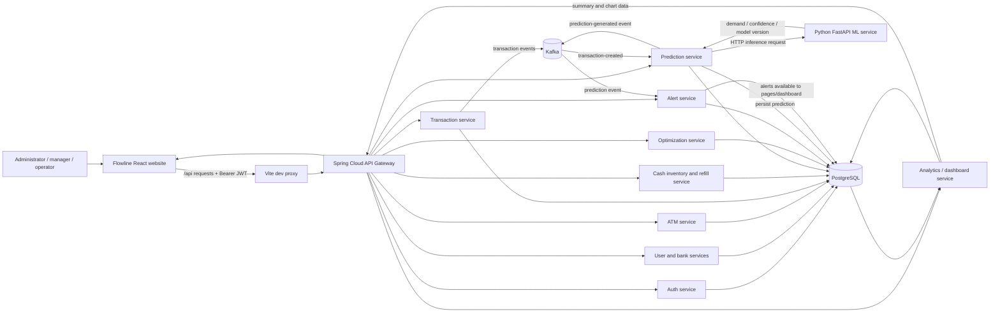

# Flowline System Workflow

This document describes the end-to-end account, workspace, ATM cash-operations, prediction, recommendation, and alert flows implemented in Flowline. For individual page controls, see [USER_GUIDE.md](USER_GUIDE.md).

## 1. Account Setup and Sign-in

### Initial super-admin setup

1. Configure the initial super-admin email and password in the backend deployment environment using `INITIAL_SUPER_ADMIN_EMAIL` and `INITIAL_SUPER_ADMIN_PASSWORD`.
2. Start the auth service. It creates this initial account only when the database has no super-admin account. Existing super-admin accounts are not replaced.
3. Open the Flowline website and sign in using that account.

### User onboarding / sign-up

There is no **Sign up** page in the website. Normal onboarding is administrator-provisioned:

1. A super admin or bank admin opens **Users** and selects **Create user**.
2. Enter the person's name, email, temporary password, role, status, and bank assignment when applicable.
3. The new user signs in at `/login` using the provisioned email and password.
4. The user sees pages allowed for their role. Bank-scoped users are limited to their assigned bank.

A backend registration endpoint also exists, but it is not connected to the website. That endpoint creates only an `ATM_OPERATOR` account and does not assign a bank, so it is not the normal website onboarding flow. The user-management page is the supported account-provisioning route.

### Login and session lifecycle

1. The browser posts credentials to `/api/auth/login` through the Vite development proxy and API gateway.
2. The auth service verifies the account and returns an access token, refresh token, role, and user identity.
3. The frontend stores the session in browser local storage and attaches the access token as a Bearer token to API requests.
4. Protected routes check that a user is signed in; role-protected routes check the user's role.
5. Expired access tokens are refreshed automatically when possible. If refresh fails, the browser session is cleared and the user returns to Sign in.
6. **Sign out** clears the local session and revokes the refresh token when available.

Forgot-password recovery is not implemented; an administrator must restore access or reset the account through the supported administrative process.

## 2. Role and Workspace Access

| Role | Main workspace responsibilities |
|---|---|
| `SUPER_ADMIN` | Cross-bank oversight; ATMs, transactions, cash, refills, predictions, recommendations, alerts, users, reports placeholder, and settings placeholder. Can request/review/complete refills. |
| `BANK_ADMIN` | Assigned-bank ATM and transaction operations, cash inventory, refill requests, and assigned-bank user administration. Cannot access prediction, recommendation, or alert pages. |
| `BANK_MANAGER` | Assigned-bank transaction review, prediction generation, recommendation decisions, alert handling, and refill approval/rejection. Cannot access cash-inventory or user pages. |
| `ATM_OPERATOR` | Assigned-bank ATM and cash visibility; may complete an approved refill. Cannot access the transaction, prediction, recommendation, alert, or user pages. |

The website may expose a page while the backend further restricts actions or bank scope. A visible page is not proof of access to every bank or operation. The UI role matrix is defined in the frontend routes and navigation; backend authorization remains authoritative.

## 3. Workspace Operating Sequence

### Step 1: Establish bank and ATM records

1. Confirm that the required bank exists and note its bank ID. The website currently has no Banks page; bank administration is available through the backend API, not the main UI.
2. Open **ATMs** and select **Add ATM**.
3. Enter the ATM code, bank ID, location, city/state, coordinates, type, status, cash capacity, minimum/maximum cash thresholds, and starting cash.
4. Save and review the ATM detail page.
5. Use the ATM directory's status/search/sort controls to locate machines; use the detail page to inspect thresholds, risk, alerts, recent transactions, cash, and prediction.

ATM codes must be unique. Capacity must be positive, cash/thresholds cannot be negative, geographic coordinates must be in range, and maximum cash threshold must not be below the minimum threshold.

### Step 2: Maintain transaction and cash records

Transactions may arrive from an integrated transaction source or a supported backend operation. The website's **Transactions** page is a history/search view; it has no transaction-entry form.

- The page supports exact ID search and filters for ATM, type, success/failure, and date range.
- Transaction types are `WITHDRAWAL`, `DEPOSIT`, `BALANCE_INQUIRY`, and `OTHER`.
- A successful withdrawal decreases ATM cash; a successful deposit increases it. Balance inquiry and Other do not change cash. A failed transaction is recorded without changing cash.
- The transaction service writes activity and audit data and emits transaction events to Kafka.

**Cash inventory** currently displays note counts and amounts but has no editing form. A supported cash-inventory update writes the denomination counts and sets the ATM's cash total to their sum. After cash-changing transactions or refill completion, reconcile the denominations so inventory totals agree with the ATM's current cash.

### Step 3: Generate predictions

1. A super admin or bank manager opens **Predictions**.
2. Select an ATM and prediction date, then choose **Generate prediction**.
3. The prediction service gathers successful withdrawal history for the ATM and calls the Python ML service.
4. The service validates and stores model output, including predicted demand, confidence, model version, and generation time.
5. Review the latest output and chart on Predictions or the ATM detail page.

Predictions require an ATM code supported by the ML service's historical dataset. A recently created ATM without matching model history may return an inference error; do not treat manually supplied sample values as model output. Transaction-created Kafka events can also trigger asynchronous prediction processing.

### Step 4: Generate and review recommendations

1. A super admin or bank manager opens **Recommendations** and selects **Generate recommendation**.
2. Choose an ATM and optionally a recommended date.
3. The optimization service uses the latest available prediction (or its configured fallback) and ATM cash/capacity values.
4. Review current cash, predicted demand, safety reserve, suggested refill amount/date, priority, and explanation.
5. Approve or reject a pending recommendation.

The service's core cash calculation is:

```text
required cash = predicted demand + safety reserve
available capacity = max(ATM capacity - current cash, 0)
recommended refill = min(max(required cash - current cash, 0), available capacity)
```

This is a planning recommendation. It does not request, approve, or complete a cash refill.

### Step 5: Request, approve, and complete a refill

1. A super admin or bank admin opens **Refills**, selects **Request refill**, chooses an ATM, enters a positive amount, and optionally adds notes.
2. The system checks that current ATM cash plus the refill will not exceed capacity.
3. A super admin or bank manager approves or rejects the request.
4. A super admin or ATM operator completes an approved request.
5. Completion increases ATM cash, records the last refill time, and marks the request completed.
6. Reconcile denomination counts separately; completion does not add notes to cash inventory.

Supported status transitions are `REQUESTED → APPROVED → COMPLETED` or `REQUESTED → REJECTED`. Rejected requests cannot be completed. The UI currently has no cancel action.

### Step 6: Monitor and respond to alerts

1. Open **Alerts** as a super admin or bank manager.
2. Filter by Active, Acknowledged, or Resolved and review severity, message, ATM, and creation time.
3. Open an alert for details.
4. Acknowledge active alerts or resolve unresolved alerts as appropriate.

Prediction generation evaluates alerts and publishes a prediction-generated event. The alert service also consumes prediction events and evaluates demand-related conditions. Alerts are created by backend evaluation/events, not manually from the Alerts page.

### Step 7: Review outcomes

Use **Overview** to see network metrics, risk, cash levels, transaction activity, forecasts, alerts, and pending recommendations. Use the relevant detailed page when you need to search, filter, inspect, or take an action. The **Reports** and **Settings** pages are placeholders and currently do not produce exports or save workspace settings.

## 4. System Flow



### Request and event behavior

- Browser traffic is sent to the API gateway; frontend code should not call individual Java service ports directly.
- The gateway routes auth, users, banks, ATMs, transactions, cash/refills, predictions, optimization, alerts, and dashboard requests to their owning services.
- Services validate requests, enforce applicable authorization and bank scope, persist records, and create audit records for supported operations.
- PostgreSQL stores ATM, user, transaction, cash inventory, refill, prediction, recommendation, alert, and audit data.
- Kafka carries asynchronous transaction and prediction events. Consumers track processed events to avoid duplicate work.
- The prediction service calls the ML service synchronously for inference; Kafka event consumers can trigger additional asynchronous processing.
- The analytics service reads stored operational data and supplies dashboard summaries and charts.

## 5. User-visible Outputs

| Workflow | Main output |
|---|---|
| Sign-in | Authenticated browser session, role, and bank assignment |
| ATM operations | ATM status, location, capacity/thresholds, cash balance, risk, recent activity |
| Transaction processing | Transaction record with type, amount, timestamp, result, and ATM; cash changes for successful withdrawals/deposits |
| Cash inventory | Denomination counts, denomination value, and total cash by selected network scope |
| Refill workflow | Request ID, amount, requester/approver, notes, dates, and lifecycle status |
| Prediction | Model demand, confidence, model version, date, and generated time |
| Recommendation | Suggested refill amount/date, priority, reason, and decision status |
| Alerts | Alert type/message, severity, ATM, timestamps, and lifecycle status |
| Dashboard | Aggregated network metrics, charts, risk list, recent activity, alert queue, and pending recommendation queue |

## 6. Website Limitations and Operational Notes

- No website sign-up page exists. Use the Users workflow or configured initial super-admin bootstrap to provision accounts.
- Backend registration exists separately and produces an unassigned ATM operator; it is not the standard website onboarding route.
- There is no Banks page, transaction-entry page, or cash-inventory edit form in the current UI.
- Prediction output depends on the model's supported ATM history and availability of the ML service.
- Reports, Settings, password recovery, top-bar global search, and top-bar notifications are not connected to live workflows.
- Empty results mean the request succeeded with no matching records. A service error means data could not be loaded; retry and check service health.
- The sidebar network-health text and alert badge are static presentation, not live service monitoring.
